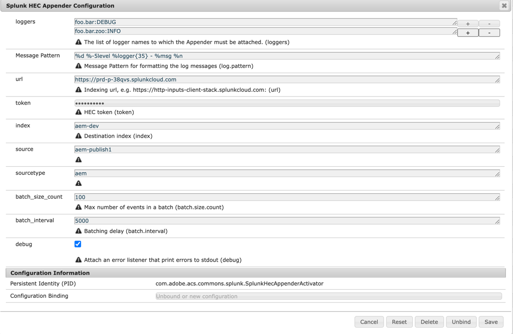

# AEM Splunk HEC Appender

## Purpose
Send AEM logs to a Splunk server using an OSGi configured Logback appender.

## How to Use

### Configuration
To configure the Splunk appender you will need to specify :

- Splunk HEC endpoint. 
- Splunk HEC token. 
- Splunk index

- See [this page](https://docs.splunk.com/Documentation/Splunk/8.0.4/Data/HECExamples) for more information.

Configure a new instance of the `com.adobe.acs.commons.splunk.SplunkHecAppenderActivator`.
To log all messages, leave the logger names field as `ROOT`, otherwise specify the specific logger names in the logger:level format, e.g.
'foo.bar:INFO'

